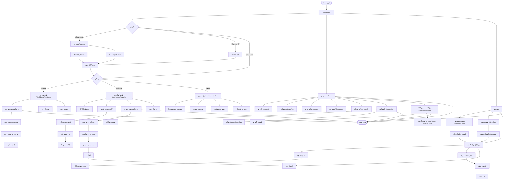

# فلوچارت تست صفحات پروژه کیستی

این سند شامل فلوچارت کامل تست تمام صفحات و ماژول‌های پروژه کیستی است.

## نمودار فلوچارت تست

## دسته‌بندی صفحات بر اساس اولویت تست

### اولویت 1: صفحات حیاتی (Critical)
این صفحات باید در اولویت اول تست شوند:

1. **صفحه اصلی** (`/`)
   - نمایش بنر و جستجوگر
   - نمایش دسته‌بندی‌ها
   - نمایش شهرها
   - دکمه‌های CTA

2. **احراز هویت**
   - ثبت نام (`/register`)
   - ورود (`/login`)
   - تأیید OTP (`/otp`)

3. **پنل کاربری**
   - پنل مشتری (`/dashboard/customer`)
   - پنل تولیدکننده (`/dashboard/supplier`)

### اولویت 2: صفحات اصلی (High Priority)
4. **جستجو و فیلتر**
   - صفحه دسته‌بندی (`/category/:slug`)
   - صفحه شهر (`/city/:slug`)
   - پروفایل تولیدکننده

5. **سیستم پیام‌رسان**
   - لیست پیام‌ها
   - گفتگو
   - ارسال پیام

6. **مدیریت درخواست‌های پروژه**
   - ثبت درخواست جدید
   - مشاهده درخواست‌ها
   - پاسخ به درخواست

### اولویت 3: صفحات تکمیلی (Medium Priority)
7. **گالری نمونه کارها**
   - افزودن نمونه کار
   - مشاهده نمونه کارها
   - جزئیات نمونه کار

8. **نظرات و امتیازها**
   - افزودن نظر
   - نمایش نظرات
   - محاسبه امتیاز

9. **صفحات عمومی**
   - درباره ما (`/about`)
   - سوالات متداول (`/faq`)
   - تماس با ما (`/contact`)

### اولویت 4: ماژول‌های خاص (Low Priority)
10. **دانشنامه تخصصی**
    - لیست مقالات (`/education`)
    - مقاله (`/education/:slug`)

11. **بازارگاه ماشین‌آلات**
    - لیست آگهی‌ها (`/machinery-market`)
    - جزئیات آگهی (`/machinery-market/:slug`)

12. **پنل ادمین**
    - مدیریت دسته‌بندی‌ها
    - مدیریت شهرها
    - مدیریت مقالات
    - مدیریت کاربران

## سناریوهای تست اصلی

### سناریو 1: کاربر مهمان
1. بازدید از صفحه اصلی
2. جستجو بر اساس شهر و تخصص
3. مشاهده پروفایل تولیدکننده
4. کلیک روی ثبت نام
5. انتخاب نقش (مشتری/تولیدکننده)
6. تکمیل فرم ثبت نام
7. دریافت و تأیید OTP
8. ورود به پنل کاربری

### سناریو 2: مشتری
1. ورود به پنل مشتری
2. ثبت درخواست پروژه جدید
3. آپلود فایل‌های پروژه
4. مشاهده درخواست‌های قبلی
5. دریافت پاسخ از تولیدکنندگان
6. شروع گفتگو با تولیدکننده
7. ارسال پیام
8. مشاهده پروفایل تولیدکننده
9. افزودن نظر و امتیاز

### سناریو 3: تولیدکننده
1. ورود به پنل تولیدکننده
2. تکمیل پروفایل کارگاه
3. افزودن نمونه کارها
4. مشاهده درخواست‌های پروژه مرتبط
5. پاسخ به درخواست
6. شروع گفتگو با مشتری
7. مدیریت پیام‌ها
8. ثبت پروژه تکمیل شده
9. درخواست نظر از مشتری

### سناریو 4: جستجو و فیلتر
1. جستجو از صفحه اصلی
2. فیلتر بر اساس شهر
3. فیلتر بر اساس تخصص
4. مشاهده نتایج
5. مشاهده پروفایل تولیدکننده
6. مشاهده نمونه کارها
7. مشاهده نظرات

## نکات مهم تست

1. **تست ریسپانسیو**: تمام صفحات باید در موبایل، تبلت و دسکتاپ تست شوند
2. **تست امنیتی**: بررسی دسترسی‌ها و احراز هویت
3. **تست عملکرد**: بررسی سرعت بارگذاری و بهینه‌سازی
4. **تست UI/UX**: بررسی تجربه کاربری و رابط کاربری
5. **تست داده**: بررسی صحت داده‌های نمایش داده شده
6. **تست فرم‌ها**: بررسی اعتبارسنجی و ارسال فرم‌ها
7. **تست فایل**: بررسی آپلود و نمایش فایل‌ها
8. **تست پیام‌رسان**: بررسی ارسال و دریافت پیام‌ها

